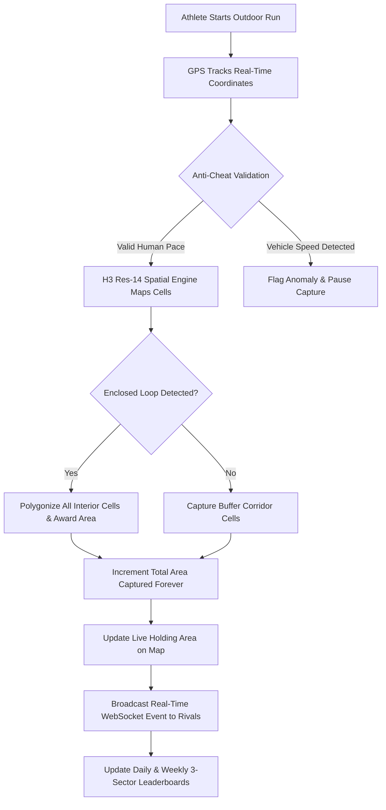

# GeoFit — Comprehensive Project Overview & System Explanation

> **Real-World Spatial Conquest Meets Athletic Gamification**  
> *Transforming every run, jog, and walk into an interactive, competitive multiplayer territory battleground.*

---

## 1. Executive Summary & Vision

Traditional fitness tracking apps (Strava, Nike Run Club, Apple Fitness) focus almost entirely on static numeric metrics: pace, heart rate, distance, and split times. While valuable for serious athletes, this approach frequently leads to workout monotony, burnout, and declining user engagement for everyday fitness enthusiasts.

**GeoFit** reimagines outdoor fitness by blending real-world spatial computation, GPS tracking, and mobile gaming mechanics (inspired by *Paper.io*, *Splatoon*, and *Pokemon GO*). Every city street, neighborhood block, local park, and campus sidewalk is converted into a live, interactive hexagonal territory grid. 

As athletes move through the physical world, their real-time GPS trajectories claim and convert territory. Competitors can contest, conquer, and steal sectors from one another, creating an evergreen social loop that turns fitness from an obligation into a thrilling game of geographic strategy.

---

## 2. Core Gameplay Mechanics: How Territory Conquest Works

### 🔷 The Hexagonal Spatial Grid (Uber H3 Indexing)
- The entire globe is partitioned using **Uber’s H3 Discrete Global Grid System** at **Resolution 14**.
- Each hexagonal cell spans approximately **~10 m²** (diameter ~2.7m), matching college pathways, jogging tracks, sidewalks, and road lanes.
- Hexagons eliminate edge-distortion and provide uniform neighboring connectivity (every hexagon has exactly 6 equidistant neighbors), ensuring fair and smooth geographic calculations anywhere on Earth.

### 🏃 Running Loops & Area Enclosure (Paper.io Engine)
GeoFit supports two primary modes of territorial expansion:
1. **Corridor Trajectory Capture**: 
   - Moving along a linear route claims a continuous corridor of ~10 m² micro-hex cells along the path.
2. **Loop & Polygon Enclosure (The Paper.io Mechanic)**:
   - When an athlete starts a run, leaves their claimed perimeter, runs a loop through contested or neutral ground, and re-connects back to their starting track or existing territory, **all interior hexagonal cells enclosed by the circuit are instantly polygonized and conquered**!
   - This rewards smart route planning: runners actively explore circular routes and loop back to claim vast multi-hectare parks and neighborhoods in a single workout.

---

## 3. The Dual Territory Invariant Model

One of GeoFit's most critical design principles is balancing competitive rivalry with personal accomplishment. GeoFit separates territory into two distinct metrics:

```
┌─────────────────────────────────────────────────────────────────────────┐
│                           GEOMETRIC ENGINE                              │
├────────────────────────────────────┬────────────────────────────────────┤
│   🚩 TOTAL AREA CAPTURED (m²)      │   🛡️ CURRENT HOLDING AREA (m²)     │
│   (Permanent Career Milestone)     │   (Live Dynamic Map Dominance)     │
├────────────────────────────────────┼────────────────────────────────────┤
│ • Monotonically cumulative sum of  │ • Calculated strictly from:        │
│   all verified conquered territory │   COUNT(active cells owned) * 10 m²│
│ • NEVER DECREASES, even if another │ • DECREASES when a rival runs      │
│   runner invades your cells.       │   through and steals your sectors. │
│ • Celebrates total athletic work.  │ • Drives active defense & rivalry. │
└────────────────────────────────────┴────────────────────────────────────┘
```

- **Total Area Captured (`total_area_captured`)**: Represents the athlete's cumulative lifetime conquest footprint. Irrespective of whether another person later captures your sectors, your total captured area **remains intact and never drops**. It reflects absolute athletic effort.
- **Current Holding Area (`current_holding_area`)**: Represents live real-time ownership on the interactive map grid. If athlete *Rahul* runs through athlete *Shivaraj*'s neighborhood, Rahul steals those cells on the live map. Rahul’s holding increases, Shivaraj’s holding decreases, but Shivaraj’s **Total Area Captured** is completely preserved.

---

## 4. Leaderboards & Competition Structure

To prevent all-time leaderboards from becoming stagnant and discouraging new runners, GeoFit structures all competitive rankings strictly around **Daily** and **Weekly** leagues with 3 distinct sectors:

### 🏆 3 Competitive Sectors
1. **🏃 Distance Covered (km)**:
   - Pure endurance metric. Ranks athletes based on total distance logged during the active timeframe.
2. **🛡️ Current Holding Area (m² & Active Sectors)**:
   - Strategic territorial metric. Measures who currently controls the largest active footprint on the city map grid right now.
3. **🚩 Total Area Captured (m² Cumulative)**:
   - Active conquest metric. Measures who has painted and conquered the most ground during the daily or weekly cycle, rewarding high exploration and large loop enclosures.

---

## 5. Live Multiplayer & Real-Time Feedback

- **Socket.IO Event Stream**: The server broadcasts live territory events over WebSockets. If another runner conquers a sector near you, your map updates in real-time.
- **Push Alerts**: In-app notifications immediately alert athletes:  
  `"⚠️ Alert: Rahul just captured your territory near Cubbon Park!"`
- **Audio Feedback**: Subtle auditory cues signal milestone achievements (500m reached, hex claimed, circuit enclosed).
- **Tactical Workout HUD**: A heads-up display overlay providing instant telemetry during outdoor workouts:
  - Live GPS coordinates & accuracy rating (±3m)
  - Current speed & average pace (min/km)
  - Distance covered & duration elapsed
  - Real-time newly conquered cell count
  - One-click Simulation Mode for indoor demonstration and testing.

---

## 6. Anti-Cheat & GPS Telemetry Integrity

To ensure fair competition and prevent users from claiming territory while driving cars or spoofing GPS:
- **Speed Anomaly Filters**: Hard speed ceiling at **36 km/h** (sprinting limit of world-class sprinters). Sustained vehicle speeds (40–120 km/h) invalidate the capture sequence.
- **Acceleration & Physics Sanity Checks**: Rejects unrealistic velocity spikes that indicate vehicular acceleration or GPS spoofing.
- **Kalman GPS Smoothing**: Filters out multi-path reflections and urban canyon jitter from high-rise buildings before coordinates hit the conquest engine.
- **Audit Logging**: Every point in an activity track is timestamped and cryptographically associated with an activity session ID for retroactive compliance checks.

---

## 7. Privacy, Safe Zones & GDPR Compliance

GeoFit takes runner safety and location privacy seriously:
- **Doorstep Territory Conquest Active Everywhere**: Athletes conquer hexagons everywhere they run without arbitrary suppression. 100% of traversed hexagons (including right outside your doorstep or hostel) are captured into your territory.
- **Strict Start Point, End Point & Path Redaction**: Other users **NEVER** see where an athlete started, where they stopped, or their exact GPS running/walking route (`routeGeometry = null`, `startPoint = null`, `endPoint = null` for all non-owner queries). Public viewers only see claimed colored hexagon tiles on the tactical map.
- **One-Click Account & Data Erasure**: Athletes have full autonomy under GDPR regulations to export their audit trails or permanently delete all personal location histories with a single button click.

---

## 8. Design & Aesthetics Philosophy

GeoFit features a modern **Clean White & Slate theme** optimized specifically for mobile outdoor visibility under direct sunlight:
- **Surfaces**: Crisp white cards (`#FFFFFF`) with subtle slate borders (`#E2E8F0`) and light grey canvas (`#F8FAFC`).
- **Typography**: High-contrast deep slate black (`#0F172A`) ensuring maximum glanceability while running or jogging.
- **Interactive Controls**:
  - **Primary Actions**: Royal Athletic Purple (`#7C3AED`)
  - **Secondary Actions**: Technical Dark Blue (`#0F172A`) and Solid Black
- **Reduced Animation Overhead**: All bouncing, pulsating, and high-frequency CSS animations have been toned down by 90% to conserve mobile battery and deliver a professional, responsive user experience.

---

## 9. Technology Stack

| Layer | Technologies Used |
| :--- | :--- |
| **Frontend Client** | React 18, Vite, MapLibre GL / Mapbox, Turf.js, H3-js, Lucide Icons, Tailwind CSS |
| **Backend Server** | Node.js, Express, Socket.IO, Better-SQLite3 / PostgreSQL (WAL mode), Cookie-Parser |
| **Spatial Engine** | Uber H3 Hexagonal Grid (Res 14 ~ 10 m²), Turf.js Polygonization, Planar Graph Enclosure |
| **Security & Auth** | JWT HTTP-only Cookies, Bcrypt Password Hashing, Anti-Cheat Anomaly Engine |
| **DevOps & Verification** | End-to-end automated verification scripts, Phase 1–14 engine regression suites |

---

## 10. Summary of Key User Workflows



GeoFit bridges digital entertainment with real-world physical health, encouraging communities to get active, explore new routes, and conquer their cities one hexagon at a time.
