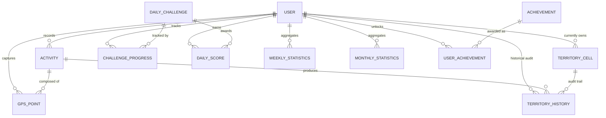

# GeoFit Territory — Database & System Architecture

This document details the architectural foundation, entity relationships, geospatial indexing, concurrency guarantees, and aggregation strategies of the GeoFit location-based fitness platform.

---

## 1. Entity-Relationship Diagram & Database Schema

### Entity Specifications

1. **`users`**
   - `id` (VARCHAR(64), PK): Unique user identifier.
   - `username` (VARCHAR(64), UNIQUE): Login handle.
   - `display_name` (VARCHAR(128)): Player display name.
   - `avatar` (VARCHAR(255)): Player avatar emoji / badge.
   - `created_at` (TIMESTAMP): Account registration timestamp.

2. **`activities`** (Permanent Immutable Workout Log)
   - `id` (VARCHAR(64), PK): Unique workout session identifier.
   - `user_id` (VARCHAR(64), FK -> users.id): Runner ID.
   - `type` (VARCHAR(16)): `RUN` or `WALK`.
   - `started_at` (TIMESTAMP): Session start timestamp.
   - `ended_at` (TIMESTAMP): Session end timestamp.
   - `distance` (DOUBLE PRECISION): Total distance in meters.
   - `duration` (INTEGER): Total elapsed active seconds.
   - `area_covered` (DOUBLE PRECISION): Area covered in square kilometers.
   - `route_geometry` (GEOMETRY(LineString, 4326) / JSON LineString): Complete trajectory.
   - `validation_status` (VARCHAR(32)): `VALID`, `FLAGGED`, `REJECTED`.
   - `created_at` (TIMESTAMP): Submission timestamp.

3. **`gps_points`** (Breadcrumbs)
   - `id` (BIGSERIAL / INTEGER PK): Coordinate point ID.
   - `activity_id` (VARCHAR(64), FK -> activities.id): Associated activity.
   - `latitude` (DOUBLE PRECISION): WGS84 Latitude.
   - `longitude` (DOUBLE PRECISION): WGS84 Longitude.
   - `timestamp` (TIMESTAMP): Fix timestamp.
   - `accuracy` (DOUBLE PRECISION): Horizontal accuracy in meters.
   - `speed` (DOUBLE PRECISION): Speed in m/s.

4. **`territory_cells`** (Dynamic Current Ownership State)
   - `h3_cell_id` (VARCHAR(32), PK): Uber H3 Resolution 14 index (~10 m²).
   - `current_owner_id` (VARCHAR(64), FK -> users.id): Current owner.
   - `current_owner_updated_at` (TIMESTAMP): Timestamp when owner took the cell.
   - `last_captured_at` (TIMESTAMP): Most recent capture event.

5. **`territory_history`** (Immutable Capture Audit Log)
   - `id` (BIGSERIAL / INTEGER PK): Capture event ID.
   - `h3_cell_id` (VARCHAR(32)): H3 cell index.
   - `user_id` (VARCHAR(64), FK -> users.id): Conquering runner.
   - `activity_id` (VARCHAR(64), FK -> activities.id): Associated workout.
   - `captured_at` (TIMESTAMP): Capture timestamp.

6. **`daily_challenges`**
   - `id` (VARCHAR(64), PK): Challenge ID.
   - `challenge_date` (DATE, UNIQUE): YYYY-MM-DD.
   - `challenge_type` (VARCHAR(32)): e.g. `DISTANCE`, `AREA`, `UNIQUE_CELLS`, `ACTIVE_DURATION`.
   - `target` (DOUBLE PRECISION): Metric target.
   - `configuration` (JSONB / TEXT): Metadata and XP bonus.
   - `start_time` (TIMESTAMP): 00:00:00 UTC.
   - `end_time` (TIMESTAMP): 23:59:59 UTC.

7. **`challenge_progress`**
   - `id` (VARCHAR(64), PK)
   - `challenge_id` (VARCHAR(64), FK -> daily_challenges.id)
   - `user_id` (VARCHAR(64), FK -> users.id)
   - `progress` (DOUBLE PRECISION): Accumulated metric.
   - `score` (INTEGER): Points earned.
   - `completed` (BOOLEAN): Completion flag.

8. **`daily_scores`**
   - `id` (VARCHAR(64), PK)
   - `challenge_id` (VARCHAR(64), FK -> daily_challenges.id)
   - `user_id` (VARCHAR(64), FK -> users.id)
   - `score` (INTEGER): Score value.
   - `created_at` (TIMESTAMP)

9. **`weekly_statistics`**
   - `id` (VARCHAR(64), PK)
   - `user_id` (VARCHAR(64), FK -> users.id)
   - `year_number` (INTEGER): ISO Year.
   - `week_number` (INTEGER): ISO Week Number.
   - `total_distance` (DOUBLE PRECISION): Total distance in meters.
   - `total_area` (DOUBLE PRECISION): Total area in km².
   - `unique_cells_count` (INTEGER): Distinct H3 cells covered.
   - `challenge_score` (INTEGER): Daily challenge points sum.
   - `activity_count` (INTEGER): Valid workout sessions.
   - `competition_score` (INTEGER): Composite performance score.

10. **`monthly_statistics`**
    - `id` (VARCHAR(64), PK)
    - `user_id` (VARCHAR(64), FK -> users.id)
    - `year_number` (INTEGER): Calendar Year.
    - `month_number` (INTEGER): Calendar Month (1-12).
    - `total_distance` (DOUBLE PRECISION): Total distance in meters.
    - `total_area` (DOUBLE PRECISION): Total area in km².
    - `competition_score` (INTEGER): Composite performance score.

11. **`achievements`**
    - Catalog of fitness and conquest milestones with unlocking timestamps.

---

## 2. Current-vs-Historical Separation Guarantees

> [!IMPORTANT]
> **Core Architectural Invariant:**
> - `territory_cells` is a transient state cache answering *"Who owns this cell right now?"*
> - `activities` and `territory_history` are append-only audit logs answering *"What physical workout did this person perform?"*

### Capture Scenario Execution:
When **User B** captures a cell currently owned by **User A**:
1. `territory_cells.current_owner_id` is updated from `user-a` to `user-b`.
2. A new record is appended to `territory_history` (`user_id = user-b`, `activity_id = act-b`).
3. **User A's records in `activities` remain 100% untouched.**
4. **User A's records in `territory_history` remain 100% untouched.**
5. User A's lifetime distance, weekly distance, and total area captured remain completely unchanged.

---

## 3. Daily & Weekly 3-Sector Aggregation Strategy

Rankings are computed across **Daily** and **Weekly** timeframes spanning 3 distinct sectors:
1. **Distance Covered**: Sum of `distance` from valid activities within the time window.
2. **Current Holding Area**: Live count of active `territory_cells` currently owned on the map grid ($\times 10\text{ m²}$).
3. **Total Area Captured**: Monotonic cumulative sum of `area_covered` captured during the period (never drops on rival takeovers).
